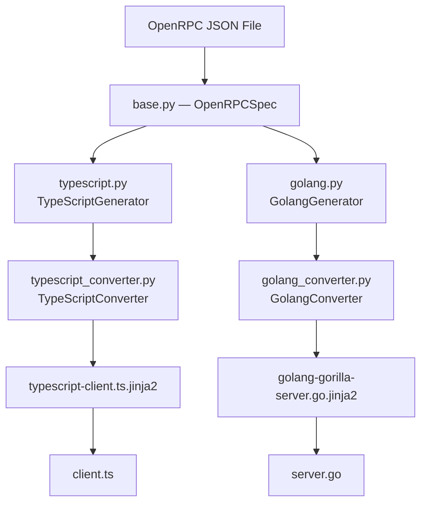
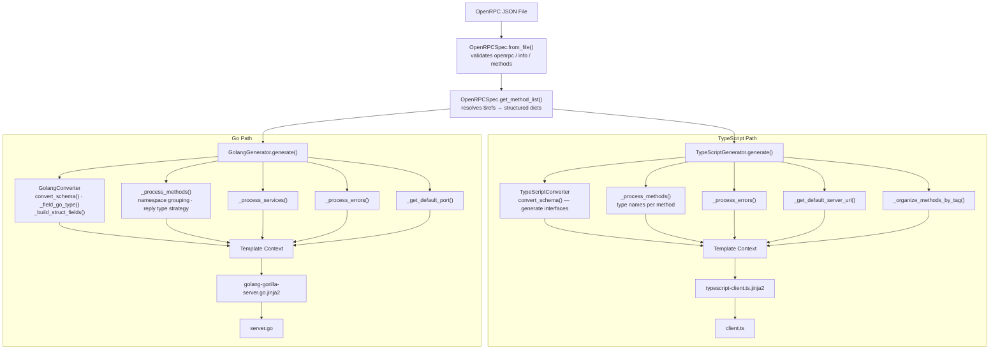

# Architecture

This document explains the architecture of py-openrpc-generator and how to extend it for new language targets.

## Design Philosophy

The generator is built on **separation of concerns** between language-agnostic and language-specific code:

- **Language-Agnostic**: OpenRPC specification parsing (`base.py`)
- **Language-Specific**: JSON Schema → target type conversion (converter), orchestration (generator), output template

This allows adding new language targets without modifying the core OpenRPC parsing logic.

## Component Overview



---

## Language-Agnostic Layer

### `generators/base.py` — OpenRPCSpec

Parses and validates OpenRPC specifications. **Completely language-agnostic** and used by all generators.

**Responsibilities:**
- Load JSON spec from file
- Validate required fields (`openrpc`, `info`, `methods`)
- Parse methods with parameters, results, errors
- Resolve `$ref` pointers for:
  - Content Descriptors (`#/components/contentDescriptors/`)
  - Errors (`#/components/errors/`)
  - Schemas (delegated to converters)
- Extract metadata (servers, tags, deprecation flags)

**Output:** Structured Python dicts via `get_method_list()`

---

## TypeScript Language Layer

### `generators/typescript_converter.py` — TypeScriptConverter

Converts JSON Schema definitions to TypeScript types.

| JSON Schema | TypeScript |
|---|---|
| `string` | `string` |
| `number` / `integer` | `number` |
| `boolean` | `boolean` |
| `null` | `null` |
| `object` (with props) | `export interface Foo { ... }` |
| `array` | `Type[]` / `Array<Type>` |
| `enum` | `"a" \| "b"` |
| `oneOf` / `anyOf` | `Type1 \| Type2` |
| `allOf` | `Type1 & Type2` |
| `$ref` | referenced type name |

Optional fields use `?` suffix. Named interfaces are emitted to `type_definitions`.

### `generators/typescript.py` — TypeScriptGenerator

Orchestrates TypeScript client generation.

**Responsibilities:**
- Initialize `TypeScriptConverter`
- Process each method → parameter and result type names
- Generate typed error classes from error definitions
- Extract default server URL with variable substitution
- Organize methods by tags
- Render Jinja2 template, write `.ts` file

### `templates/typescript-client.ts.jinja2`

Generates a single TypeScript file containing:
- Named type interfaces (from converter)
- JSON-RPC 2.0 infrastructure (request/response types)
- Error classes (`JsonRpcError` base + application-specific subclasses)
- `createJsonRpcError()` factory function
- Client class with typed async methods, organized by tags

---

## Go Language Layer

### `generators/golang_converter.py` — GolangConverter

Converts JSON Schema definitions to Go types.

| JSON Schema | Go type |
|---|---|
| `string` | `string` |
| `integer` | `int64` |
| `number` | `float64` |
| `boolean` | `bool` |
| `null` | `interface{}` |
| `object` (with props) | named `struct` with JSON tags |
| `object` (no props) | `map[string]interface{}` |
| `array` | `[]T` |
| `enum` | `string` (or `int64`) |
| `oneOf` / `anyOf` | `interface{}` |
| `allOf` | merged struct |
| `$ref` | referenced type name |

**Key design decisions:**

**Optional vs required fields:**
Required fields use value types. Optional fields use pointer types with `omitempty`:
```go
Name  string  `json:"name"`           // required
Age   *int64  `json:"age,omitempty"`  // optional
```

**No anonymous structs — always named types:**
Nested object fields are given names derived from their parent type + field name:
```
UserServiceUpdateArgs + Data  →  UserServiceUpdateArgsData
SearchServiceQueryResult + Items (array items)  →  SearchServiceQueryResultItem
```
This avoids anonymous structs and indentation issues in generated code.

The `_field_go_type(prop_schema, go_name, parent_type_name)` method centralises this
logic and is shared between `_build_struct_fields` and `golang.py._build_args_fields`.

**JSON field name → Go field name (`go_field_name`):**
- `userId` → `UserID`
- `createdAt` → `CreatedAt`
- `url` → `URL`

Common Go acronyms (`id`, `url`, `uri`, `api`, `http`, …) are uppercased.

### `generators/golang.py` — GolangGenerator

Orchestrates Go server generation.

**Service grouping by namespace prefix:**

```
user.getById  →  namespace="user"   service="UserService"  method="GetById"
math.add      →  namespace="math"   service="MathService"  method="Add"
ping          →  namespace="default" service="DefaultService" method="Ping"
```

Methods are grouped into service structs. Services are alphabetically sorted;
`DefaultService` (for namespace-less methods) is always last.

**Reply type strategy:**

| Result schema | Generated reply type |
|---|---|
| `$ref` to named type | `type XReply = ReferencedType` (alias) |
| `type: object` | Named result struct; alias |
| `type: array` | Wrapper `XResult{Items []T}`; alias |
| Scalar (`string`, `number`, …) | Wrapper `XResult{Result T}`; alias |
| No result (notification) | `type XReply struct{}` |

**Error processing:**
Collects all error codes across all methods, deduplicates, and derives Go struct names
from the error message (e.g. `"User not found"` → `UserNotFoundError`).

**Port extraction:**
Parses a port number from the first server URL, falling back to 8080.

### `templates/golang-gorilla-server.go.jinja2`

Generates a single Go file:
1. File header comment (spec title, version, DO NOT EDIT notice)
2. `package` declaration
3. `import` block — `fmt` is only included when error types exist
4. Named type definitions from `components/schemas`
5. For each service:
   - Args/Reply structs for each method (with positional-param note if applicable)
   - Service struct declaration with registration comment
   - Handler method stubs with Go doc comments, error list, deprecation marker
6. Typed error structs + constructors (if spec defines errors)
7. `main()` registering all services and starting the HTTP listener

---

## Data Flow — Full Picture



---

## Adding a New Language

The pattern is consistent across all language targets:

1. **Converter** — maps JSON Schema to the target language's type system
2. **Generator** — orchestrates the conversion and builds the template context
3. **Template** — Jinja2 template that renders the final output file
4. **CLI** — add the language choice and wire it up

### Step 1: Create a Converter

`generators/python_converter.py` (example):

```python
"""JSON Schema to Python type converter."""
from typing import Any, Dict, List, Set, Optional


class PythonConverter:
    def __init__(self, components: Dict[str, Any] = None):
        self.components = components or {}
        self.schemas = self.components.get("schemas", {})
        self.generated_types: Set[str] = set()
        self.type_definitions: List[str] = []

    def convert_schema(self, schema: Dict[str, Any], type_name: Optional[str] = None) -> str:
        if not schema:
            return "Any"
        if "$ref" in schema:
            return self.resolve_ref(schema["$ref"])

        schema_type = schema.get("type")
        if schema_type == "string":
            return "str"
        elif schema_type in ("number", "integer"):
            return "float" if schema_type == "number" else "int"
        elif schema_type == "boolean":
            return "bool"
        elif schema_type == "object":
            return self._convert_object(schema, type_name)
        elif schema_type == "array":
            return self._convert_array(schema)
        return "Any"

    def _convert_object(self, schema, type_name):
        if not type_name:
            return "dict[str, Any]"
        if type_name in self.generated_types:
            return type_name
        self.generated_types.add(type_name)
        properties = schema.get("properties", {})
        required = schema.get("required", [])
        fields = []
        for name, prop in properties.items():
            t = self.convert_schema(prop)
            if name not in required:
                t = f"NotRequired[{t}]"
            fields.append(f"    {name}: {t}")
        self.type_definitions.append(f"class {type_name}(TypedDict):\n" + "\n".join(fields))
        return type_name

    def _convert_array(self, schema):
        items = schema.get("items", {})
        return f"list[{self.convert_schema(items)}]" if items else "list[Any]"

    def resolve_ref(self, ref):
        if ref.startswith("#/components/schemas/"):
            name = ref.split("/")[-1]
            if name not in self.generated_types and name in self.schemas:
                self.convert_schema(self.schemas[name], name)
            return name
        return "Any"

    def get_all_type_definitions(self):
        return "\n\n".join(self.type_definitions)
```

### Step 2: Create a Generator

`generators/python.py`:

```python
from pathlib import Path
from jinja2 import Environment, PackageLoader, select_autoescape
from .base import OpenRPCSpec
from .python_converter import PythonConverter


class PythonGenerator:
    def __init__(self):
        self.env = Environment(
            loader=PackageLoader("py_openrpc_generator", "templates"),
            autoescape=select_autoescape(),
            trim_blocks=True,
            lstrip_blocks=True,
        )

    def generate(self, spec: OpenRPCSpec, output_path: str, class_name: str = "RPCClient") -> None:
        template = self.env.get_template("python-client.py.jinja2")
        converter = PythonConverter(spec.components)
        methods = self._process_methods(spec.get_method_list(), converter)
        context = {
            "info": spec.info,
            "methods": methods,
            "class_name": class_name,
            "type_definitions": converter.get_all_type_definitions(),
        }
        output = template.render(**context)
        Path(output_path).write_text(output, encoding="utf-8")
```

### Step 3: Create a Template

`templates/python-client.py.jinja2`:

```python
"""
{{ info.title }}
{{ info.description }}
Version: {{ info.version }}

Auto-generated by py-openrpc-generator
"""
from typing import Any
import requests

{{ type_definitions }}


class JsonRpcError(Exception):
    def __init__(self, code: int, message: str, data: Any = None):
        self.code = code
        self.data = data
        super().__init__(f"JSON-RPC Error {code}: {message}")


class {{ class_name }}:
    def __init__(self, url: str):
        self.url = url
        self._id = 0

    def _call(self, method: str, params: Any = None) -> Any:
        self._id += 1
        resp = requests.post(self.url, json={
            "jsonrpc": "2.0", "method": method, "params": params, "id": self._id
        })
        resp.raise_for_status()
        data = resp.json()
        if "error" in data:
            e = data["error"]
            raise JsonRpcError(e["code"], e["message"], e.get("data"))
        return data.get("result")


    def {{ method.safe_name }}(self, params) -> Any:
        """{{ method.summary or method.name }}"""
        return self._call("{{ method.name }}", params)

```

### Step 4: Update CLI

`cli.py`:

```python
from .generators.python import PythonGenerator

# In the generate command handler:
elif args.language == "python":
    generator = PythonGenerator()
    generator.generate(spec, output_path, args.class_name)
```

Also add `"python"` to the `choices` list in the `--language` argument.

---

## Key Conventions

### Converter Interface

All converters follow the same interface so generators can be written predictably:

```python
class XConverter:
    def __init__(self, components: dict): ...
    def convert_schema(self, schema: dict, type_name: str = None) -> str: ...
    def resolve_ref(self, ref: str) -> str: ...
    def get_all_type_definitions(self) -> str: ...
```

`type_definitions` is a list of strings accumulated during `convert_schema` calls.
`generated_types` is a set of already-generated type names (prevents duplicates).

### Template Context

Generators build a context dict and pass it to `template.render(**context)`. Minimum keys:

| Key | Type | Description |
|---|---|---|
| `info` | dict | OpenRPC info object |
| `type_definitions` | str | All generated type definitions joined by `\n\n` |
| `error_types` | list[dict] | Deduplicated error definitions |

Language-specific keys are added as needed (e.g. `services` for Go, `methods_by_tag` for TypeScript).

### Template Settings

All generators use:
```python
env = Environment(
    loader=PackageLoader("py_openrpc_generator", "templates"),
    autoescape=select_autoescape(),
    trim_blocks=True,    # strips newline after  tags
    lstrip_blocks=True,  # strips leading whitespace before  tags
)
```

With these settings, block tags (``, ``, ``) must be on their own
lines to avoid collapsing adjacent content lines together.

---

## Best Practices

1. **Keep `base.py` language-agnostic** — never add language-specific logic there
2. **Consistent converter interface** — all converters should expose `convert_schema`, `resolve_ref`, `get_all_type_definitions`
3. **No anonymous types** — always generate named types for nested objects (avoids indentation/readability issues)
4. **Avoid duplicate type generation** — use `generated_types: Set[str]` to track what has been emitted
5. **Conditional imports** — only import packages actually used (e.g. `fmt` in Go only when error types are present)
6. **Test with both example specs** — `example-spec.json` (simple) and `example-spec-advanced.json` (all features)

---

## Future Enhancements

1. **Abstract base converter** — `BaseConverter` ABC with required methods
2. **Plugin system** — load converters/generators dynamically from entry points
3. **Per-language config** — style preferences, naming conventions, framework choice
4. **JSON Schema validation** — validate OpenRPC specs before generation
5. **Multiple output files** — one file per service/namespace for Go, one module per tag for TypeScript
6. **Additional Go targets** — `net/rpc` (stdlib), gRPC-gateway, connectrpc
7. **Additional client targets** — Python (requests / httpx), Rust, Java
